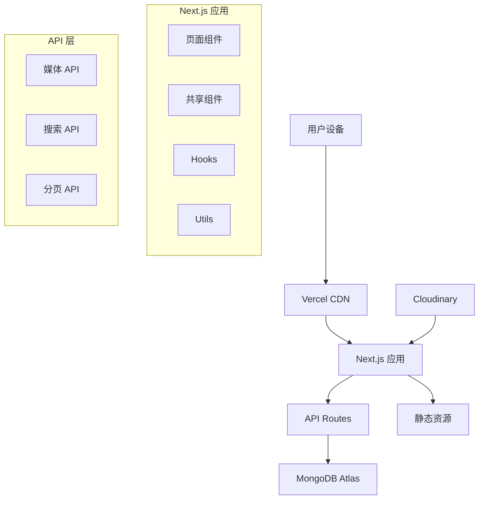

# Design Document

## Overview

多端画廊项目采用现代化的全栈架构，使用 Next.js 作为 React 框架以获得更好的 SEO 和性能，结合 MongoDB Atlas 云数据库和 Vercel 无服务器部署。项目将实现响应式设计、优雅的 UI 交互和高性能的媒体展示功能。

## Architecture

### 技术栈
- **前端**: Next.js 14 (React 18) + TypeScript
- **样式**: Tailwind CSS + Framer Motion (动画)
- **状态管理**: Zustand (轻量级状态管理)
- **数据库**: MongoDB Atlas
- **ORM**: Mongoose
- **部署**: Vercel
- **图片优化**: Next.js Image Optimization + Cloudinary (可选)

### 系统架构图



## Components and Interfaces

### 核心组件结构

```
src/
├── components/
│   ├── ui/                 # 基础 UI 组件
│   │   ├── Button.tsx
│   │   ├── Modal.tsx
│   │   ├── Loading.tsx
│   │   └── SearchInput.tsx
│   ├── gallery/            # 画廊相关组件
│   │   ├── GalleryGrid.tsx
│   │   ├── MediaCard.tsx
│   │   ├── MediaModal.tsx
│   │   └── FilterBar.tsx
│   └── layout/             # 布局组件
│       ├── Header.tsx
│       ├── Footer.tsx
│       └── Navigation.tsx
├── pages/
│   ├── api/                # API 路由
│   │   ├── media/
│   │   └── search/
│   ├── index.tsx           # 首页
│   ├── gallery/
│   └── media/[id].tsx      # 媒体详情页
├── lib/
│   ├── mongodb.ts          # 数据库连接
│   ├── models/             # 数据模型
│   └── utils/              # 工具函数
├── hooks/                  # 自定义 Hooks
├── store/                  # 状态管理
└── styles/                 # 样式文件
```

### 主要接口定义

```typescript
// 媒体资源接口
interface MediaItem {
  _id: string;
  title: string;
  description?: string;
  url: string;
  thumbnailUrl: string;
  type: 'image' | 'video';
  tags: string[];
  createdAt: Date;
  updatedAt: Date;
  metadata: {
    width?: number;
    height?: number;
    size?: number;
    format?: string;
  };
}

// API 响应接口
interface MediaResponse {
  data: MediaItem[];
  pagination: {
    page: number;
    limit: number;
    total: number;
    totalPages: number;
  };
}

// 搜索参数接口
interface SearchParams {
  query?: string;
  type?: 'image' | 'video' | 'all';
  tags?: string[];
  page?: number;
  limit?: number;
  sortBy?: 'createdAt' | 'title';
  sortOrder?: 'asc' | 'desc';
}
```

## Data Models

### MongoDB 数据模型

```javascript
// Media Schema
const MediaSchema = new mongoose.Schema({
  title: {
    type: String,
    required: true,
    trim: true,
    maxlength: 200
  },
  description: {
    type: String,
    trim: true,
    maxlength: 1000
  },
  url: {
    type: String,
    required: true,
    validate: {
      validator: function(v) {
        return /^https?:\/\/.+/.test(v);
      },
      message: 'URL must be a valid HTTP/HTTPS URL'
    }
  },
  thumbnailUrl: {
    type: String,
    required: true
  },
  type: {
    type: String,
    enum: ['image', 'video'],
    required: true
  },
  tags: [{
    type: String,
    trim: true,
    lowercase: true
  }],
  metadata: {
    width: Number,
    height: Number,
    size: Number,
    format: String
  },
  isActive: {
    type: Boolean,
    default: true
  }
}, {
  timestamps: true
});

// 索引优化
MediaSchema.index({ title: 'text', description: 'text', tags: 'text' });
MediaSchema.index({ type: 1, createdAt: -1 });
MediaSchema.index({ tags: 1 });
MediaSchema.index({ isActive: 1, createdAt: -1 });
```

## Error Handling

### 错误处理策略

1. **API 错误处理**
   - 统一的错误响应格式
   - 适当的 HTTP 状态码
   - 详细的错误信息记录

2. **前端错误处理**
   - React Error Boundary 捕获组件错误
   - 网络请求错误的重试机制
   - 用户友好的错误提示

3. **数据库错误处理**
   - 连接失败的重试逻辑
   - 查询超时处理
   - 数据验证错误处理

```typescript
// 统一错误处理中间件
export class ApiError extends Error {
  statusCode: number;
  
  constructor(message: string, statusCode: number = 500) {
    super(message);
    this.statusCode = statusCode;
  }
}

// 错误响应格式
interface ErrorResponse {
  success: false;
  error: {
    message: string;
    code: string;
    statusCode: number;
  };
}
```

## Testing Strategy

### 测试层级

1. **单元测试**
   - 组件测试 (React Testing Library)
   - 工具函数测试 (Jest)
   - API 路由测试

2. **集成测试**
   - 数据库操作测试
   - API 端到端测试
   - 组件集成测试

3. **E2E 测试**
   - 用户流程测试 (Playwright)
   - 跨浏览器兼容性测试
   - 响应式设计测试

### 性能优化策略

1. **图片优化**
   - Next.js Image 组件自动优化
   - WebP 格式支持
   - 响应式图片加载

2. **代码分割**
   - 动态导入组件
   - 路由级别的代码分割
   - 第三方库按需加载

3. **缓存策略**
   - 静态资源缓存
   - API 响应缓存
   - 浏览器缓存优化

4. **数据库优化**
   - 合适的索引设计
   - 查询优化
   - 连接池管理

### UI/UX 设计原则

1. **响应式设计**
   - Mobile-first 设计方法
   - 断点设计: 320px, 768px, 1024px, 1440px
   - 触摸友好的交互设计

2. **视觉设计**
   - 现代化的卡片式布局
   - 优雅的动画过渡效果
   - 一致的颜色和字体系统
   - 暗色/亮色主题支持

3. **交互设计**
   - 直观的导航结构
   - 快速的搜索和筛选
   - 流畅的滚动和加载体验
   - 键盘导航支持

### 部署配置

1. **Vercel 配置**
   - 自动部署设置
   - 环境变量管理
   - 域名和 SSL 配置

2. **MongoDB Atlas 配置**
   - 网络访问白名单
   - 数据库用户权限
   - 连接字符串安全管理

3. **性能监控**
   - Vercel Analytics 集成
   - 错误监控设置
   - 性能指标追踪