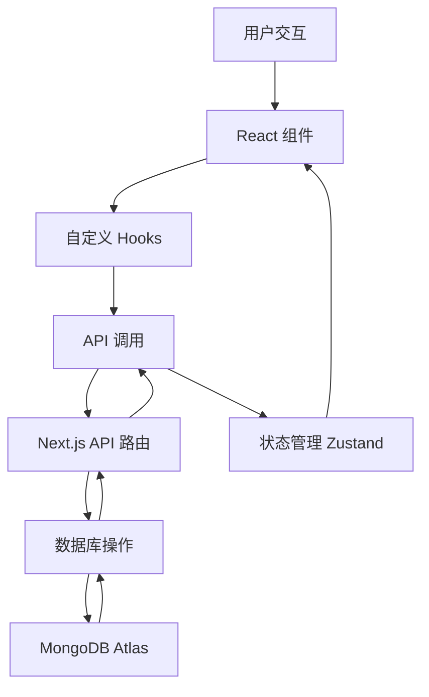

# 开发指南

本文档为多端画廊项目的开发者提供详细的开发规范、最佳实践和工作流程指导。

## 📋 目录

- [开发环境设置](#开发环境设置)
- [项目架构](#项目架构)
- [开发规范](#开发规范)
- [Git 工作流](#git-工作流)
- [代码质量](#代码质量)
- [测试策略](#测试策略)
- [性能优化](#性能优化)
- [调试技巧](#调试技巧)
- [常见问题](#常见问题)

## 🛠️ 开发环境设置

### 系统要求

- **Node.js**: 18.0.0 或更高版本
- **npm**: 8.0.0 或更高版本
- **Git**: 2.30.0 或更高版本
- **VS Code**: 推荐的代码编辑器

### 环境安装

```bash
# 检查 Node.js 版本
node --version

# 检查 npm 版本
npm --version

# 全局安装开发工具
npm install -g typescript @types/node
```

### VS Code 扩展

推荐安装以下扩展：

```json
{
  "recommendations": [
    "bradlc.vscode-tailwindcss",
    "esbenp.prettier-vscode",
    "dbaeumer.vscode-eslint",
    "ms-vscode.vscode-typescript-next",
    "formulahendry.auto-rename-tag",
    "christian-kohler.path-intellisense",
    "ms-vscode.vscode-json",
    "redhat.vscode-yaml"
  ]
}
```

### 项目初始化

```bash
# 克隆项目
git clone https://github.com/your-username/multi-platform-gallery.git
cd multi-platform-gallery

# 安装依赖
npm install

# 复制环境变量
cp .env.example .env.local

# 启动开发服务器
npm run dev
```

## 🏗️ 项目架构

### 技术栈

```
Frontend:
├── Next.js 14        # React 框架
├── TypeScript        # 类型系统
├── Tailwind CSS      # 样式框架
├── Framer Motion     # 动画库
└── Zustand          # 状态管理

Backend:
├── Next.js API       # API 路由
├── MongoDB Atlas     # 数据库
├── Mongoose         # ODM
└── NextAuth.js      # 身份验证

Tools:
├── ESLint           # 代码检查
├── Prettier         # 代码格式化
├── Husky           # Git hooks
├── Jest            # 测试框架
└── TypeScript      # 类型检查
```

### 目录结构

```
src/
├── components/          # React 组件
│   ├── ui/             # 基础 UI 组件
│   │   ├── Button.tsx
│   │   ├── Modal.tsx
│   │   └── index.ts    # 统一导出
│   ├── gallery/        # 业务组件
│   │   ├── MediaCard.tsx
│   │   ├── GalleryGrid.tsx
│   │   └── MediaModal.tsx
│   ├── layout/         # 布局组件
│   │   ├── Header.tsx
│   │   ├── Footer.tsx
│   │   └── Layout.tsx
│   └── dev/           # 开发工具组件
├── hooks/             # 自定义 Hooks
│   ├── useMedia.ts
│   ├── useSearch.ts
│   └── useInfiniteScroll.ts
├── lib/               # 工具库
│   ├── models/        # 数据模型
│   │   └── Media.ts
│   ├── utils/         # 工具函数
│   │   ├── api.ts
│   │   ├── format.ts
│   │   └── validation.ts
│   ├── middleware/    # 中间件
│   └── services/      # 服务层
├── pages/             # Next.js 页面
│   ├── api/          # API 路由
│   │   ├── media/
│   │   └── search/
│   ├── gallery/      # 画廊页面
│   └── media/        # 媒体详情页
├── store/            # 状态管理
│   ├── mediaStore.ts
│   └── uiStore.ts
├── styles/           # 样式文件
│   └── globals.css
└── types/            # 类型定义
    ├── api.ts
    ├── media.ts
    └── index.ts
```

### 数据流



## 📝 开发规范

### 命名规范

#### 文件命名

```bash
# 组件文件 - PascalCase
MediaCard.tsx
GalleryGrid.tsx

# 工具文件 - camelCase
apiUtils.ts
formatUtils.ts

# 页面文件 - kebab-case
media-detail.tsx
gallery-grid.tsx

# 常量文件 - UPPER_CASE
API_ENDPOINTS.ts
DEFAULT_CONFIG.ts
```

#### 变量命名

```typescript
// 常量 - UPPER_SNAKE_CASE
const API_BASE_URL = 'https://api.example.com';
const MAX_RETRY_COUNT = 3;

// 变量和函数 - camelCase
const mediaList = [];
const fetchMediaData = async () => {};

// 组件 - PascalCase
const MediaCard = () => {};
const GalleryGrid = () => {};

// 类型和接口 - PascalCase
interface MediaItem {}
type ApiResponse<T> = {};
```

### 代码组织

#### 组件结构

```typescript
// 1. 导入语句
import React, { useState, useEffect } from 'react';
import { NextPage } from 'next';
import { MediaItem } from '@/types';

// 2. 类型定义
interface MediaCardProps {
  media: MediaItem;
  onClick?: (media: MediaItem) => void;
  className?: string;
}

// 3. 组件实现
export const MediaCard: React.FC<MediaCardProps> = ({
  media,
  onClick,
  className = ''
}) => {
  // 4. 状态和副作用
  const [isLoading, setIsLoading] = useState(false);
  
  useEffect(() => {
    // 副作用逻辑
  }, []);

  // 5. 事件处理函数
  const handleClick = () => {
    onClick?.(media);
  };

  // 6. 渲染逻辑
  return (
    <div className={`media-card ${className}`} onClick={handleClick}>
      {/* JSX 内容 */}
    </div>
  );
};

// 7. 默认导出
export default MediaCard;
```

#### API 路由结构

```typescript
// pages/api/media/index.ts
import { NextApiRequest, NextApiResponse } from 'next';
import { connectToDatabase } from '@/lib/mongodb';
import { validateRequest } from '@/lib/middleware';

// 1. 类型定义
interface MediaQuery {
  page?: string;
  limit?: string;
  type?: string;
}

// 2. 主处理函数
export default async function handler(
  req: NextApiRequest,
  res: NextApiResponse
) {
  // 3. 方法检查
  if (req.method !== 'GET') {
    return res.status(405).json({ message: 'Method not allowed' });
  }

  try {
    // 4. 参数验证
    const { page = '1', limit = '12', type } = req.query as MediaQuery;
    
    // 5. 业务逻辑
    const result = await getMediaList({ page, limit, type });
    
    // 6. 响应返回
    return res.status(200).json(result);
  } catch (error) {
    // 7. 错误处理
    console.error('API Error:', error);
    return res.status(500).json({ message: 'Internal server error' });
  }
}

// 8. 辅助函数
async function getMediaList(params: MediaQuery) {
  // 实现逻辑
}
```

### TypeScript 规范

#### 类型定义

```typescript
// 基础类型
interface MediaItem {
  _id: string;
  title: string;
  description?: string;
  url: string;
  type: 'image' | 'video';
  tags: string[];
  createdAt: Date;
  updatedAt: Date;
}

// 泛型类型
interface ApiResponse<T> {
  success: boolean;
  data: T;
  message?: string;
}

// 联合类型
type MediaType = 'image' | 'video' | 'all';
type SortOrder = 'asc' | 'desc';

// 工具类型
type MediaUpdate = Partial<Pick<MediaItem, 'title' | 'description' | 'tags'>>;
type MediaCreate = Omit<MediaItem, '_id' | 'createdAt' | 'updatedAt'>;

// 条件类型
type ApiResult<T> = T extends string 
  ? { message: T } 
  : { data: T };
```

#### 组件 Props 类型

```typescript
// 基础 Props
interface ButtonProps {
  children: React.ReactNode;
  variant?: 'primary' | 'secondary';
  size?: 'sm' | 'md' | 'lg';
  disabled?: boolean;
  onClick?: () => void;
}

// 扩展 HTML 属性
interface InputProps extends React.InputHTMLAttributes<HTMLInputElement> {
  label?: string;
  error?: string;
  helperText?: string;
}

// 泛型 Props
interface ListProps<T> {
  items: T[];
  renderItem: (item: T, index: number) => React.ReactNode;
  keyExtractor: (item: T) => string;
}
```

### CSS 和样式规范

#### Tailwind CSS 使用

```typescript
// 组件样式
const MediaCard = ({ className = '' }) => {
  return (
    <div className={`
      relative overflow-hidden rounded-lg bg-white shadow-md
      transition-transform duration-200 hover:scale-105
      ${className}
    `}>
      {/* 内容 */}
    </div>
  );
};

// 条件样式
const Button = ({ variant, size, disabled }) => {
  const baseClasses = 'inline-flex items-center justify-center rounded-md font-medium transition-colors';
  
  const variantClasses = {
    primary: 'bg-blue-600 text-white hover:bg-blue-700',
    secondary: 'bg-gray-200 text-gray-900 hover:bg-gray-300',
  };
  
  const sizeClasses = {
    sm: 'px-3 py-2 text-sm',
    md: 'px-4 py-2 text-base',
    lg: 'px-6 py-3 text-lg',
  };
  
  const classes = [
    baseClasses,
    variantClasses[variant],
    sizeClasses[size],
    disabled && 'opacity-50 cursor-not-allowed'
  ].filter(Boolean).join(' ');
  
  return <button className={classes}>{/* 内容 */}</button>;
};
```

#### 自定义 CSS

```css
/* globals.css */

/* CSS 变量 */
:root {
  --color-primary: #3b82f6;
  --color-secondary: #6b7280;
  --spacing-unit: 0.25rem;
  --border-radius: 0.5rem;
}

/* 工具类 */
.container {
  @apply mx-auto max-w-7xl px-4 sm:px-6 lg:px-8;
}

.btn-primary {
  @apply inline-flex items-center justify-center rounded-md bg-blue-600 px-4 py-2 text-sm font-medium text-white transition-colors hover:bg-blue-700 focus:outline-none focus:ring-2 focus:ring-blue-500 focus:ring-offset-2;
}

/* 响应式设计 */
@media (max-width: 768px) {
  .gallery-grid {
    grid-template-columns: repeat(2, 1fr);
  }
}

@media (max-width: 480px) {
  .gallery-grid {
    grid-template-columns: 1fr;
  }
}
```

## 🔄 Git 工作流

### 分支策略

```bash
main          # 生产分支，只接受来自 develop 的合并
├── develop   # 开发分支，功能集成
├── feature/* # 功能分支
├── hotfix/*  # 热修复分支
└── release/* # 发布分支
```

### 分支命名规范

```bash
# 功能分支
feature/user-authentication
feature/media-upload
feature/search-optimization

# 修复分支
fix/image-loading-issue
fix/api-error-handling

# 热修复分支
hotfix/security-patch
hotfix/critical-bug-fix

# 发布分支
release/v1.0.0
release/v1.1.0
```

### 提交信息规范

使用 [Conventional Commits](https://www.conventionalcommits.org/) 规范：

```bash
# 格式
<type>[optional scope]: <description>

[optional body]

[optional footer(s)]

# 示例
feat(gallery): add infinite scroll loading
fix(api): handle database connection timeout
docs(readme): update installation instructions
style(ui): improve button hover effects
refactor(hooks): optimize useMedia hook performance
test(api): add unit tests for search endpoint
chore(deps): update dependencies to latest versions
```

### 提交类型

- `feat`: 新功能
- `fix`: 修复 bug
- `docs`: 文档更新
- `style`: 代码格式修改
- `refactor`: 代码重构
- `test`: 测试相关
- `chore`: 构建过程或辅助工具的变动
- `perf`: 性能优化
- `ci`: CI/CD 相关

### 工作流程

```bash
# 1. 从 develop 创建功能分支
git checkout develop
git pull origin develop
git checkout -b feature/new-feature

# 2. 开发和提交
git add .
git commit -m "feat(component): add new media card component"

# 3. 推送分支
git push origin feature/new-feature

# 4. 创建 Pull Request
# 在 GitHub 上创建 PR，目标分支为 develop

# 5. 代码审查和合并
# 审查通过后合并到 develop

# 6. 删除功能分支
git branch -d feature/new-feature
git push origin --delete feature/new-feature
```

## 🔍 代码质量

### ESLint 配置

```json
// .eslintrc.json
{
  "extends": [
    "next/core-web-vitals",
    "@typescript-eslint/recommended",
    "prettier"
  ],
  "parser": "@typescript-eslint/parser",
  "plugins": ["@typescript-eslint"],
  "rules": {
    "@typescript-eslint/no-unused-vars": "error",
    "@typescript-eslint/no-explicit-any": "warn",
    "@typescript-eslint/explicit-function-return-type": "off",
    "prefer-const": "error",
    "no-var": "error",
    "no-console": "warn",
    "react-hooks/exhaustive-deps": "warn"
  },
  "overrides": [
    {
      "files": ["*.test.ts", "*.test.tsx"],
      "rules": {
        "@typescript-eslint/no-explicit-any": "off"
      }
    }
  ]
}
```

### Prettier 配置

```json
// .prettierrc
{
  "semi": true,
  "trailingComma": "es5",
  "singleQuote": true,
  "printWidth": 80,
  "tabWidth": 2,
  "useTabs": false,
  "bracketSpacing": true,
  "arrowParens": "avoid",
  "endOfLine": "lf"
}
```

### 代码审查清单

#### 功能性
- [ ] 功能是否按预期工作
- [ ] 边界情况是否处理
- [ ] 错误处理是否完善
- [ ] 性能是否可接受

#### 代码质量
- [ ] 代码是否易读易懂
- [ ] 变量和函数命名是否清晰
- [ ] 是否遵循项目规范
- [ ] 是否有重复代码

#### 安全性
- [ ] 输入验证是否充分
- [ ] 敏感信息是否泄露
- [ ] 权限检查是否正确
- [ ] XSS/CSRF 防护是否到位

#### 测试
- [ ] 是否有足够的测试覆盖
- [ ] 测试是否有意义
- [ ] 是否测试了边界情况
- [ ] 测试是否可维护

## 🧪 测试策略

### 测试金字塔

```
    E2E Tests (少量)
   ┌─────────────────┐
  │  Integration Tests │ (适量)
 └─────────────────────┘
┌─────────────────────────┐
│     Unit Tests          │ (大量)
└─────────────────────────┘
```

### 单元测试

```typescript
// __tests__/components/MediaCard.test.tsx
import { render, screen, fireEvent } from '@testing-library/react';
import { MediaCard } from '@/components/gallery/MediaCard';
import { MediaItem } from '@/types';

const mockMedia: MediaItem = {
  _id: '1',
  title: 'Test Image',
  url: '/test.jpg',
  thumbnailUrl: '/test-thumb.jpg',
  type: 'image',
  tags: ['test'],
  createdAt: new Date(),
  updatedAt: new Date(),
};

describe('MediaCard', () => {
  it('renders media title correctly', () => {
    render(<MediaCard media={mockMedia} />);
    expect(screen.getByText('Test Image')).toBeInTheDocument();
  });

  it('calls onClick when clicked', () => {
    const handleClick = jest.fn();
    render(<MediaCard media={mockMedia} onClick={handleClick} />);
    
    fireEvent.click(screen.getByRole('button'));
    expect(handleClick).toHaveBeenCalledWith(mockMedia);
  });

  it('displays tags correctly', () => {
    render(<MediaCard media={mockMedia} showTags />);
    expect(screen.getByText('test')).toBeInTheDocument();
  });
});
```

### 集成测试

```typescript
// __tests__/api/media.test.ts
import { createMocks } from 'node-mocks-http';
import handler from '@/pages/api/media/index';

describe('/api/media', () => {
  it('returns media list with correct format', async () => {
    const { req, res } = createMocks({
      method: 'GET',
      query: { page: '1', limit: '10' },
    });

    await handler(req, res);

    expect(res._getStatusCode()).toBe(200);
    
    const data = JSON.parse(res._getData());
    expect(data).toHaveProperty('success', true);
    expect(data).toHaveProperty('data');
    expect(data).toHaveProperty('pagination');
  });

  it('handles invalid parameters', async () => {
    const { req, res } = createMocks({
      method: 'GET',
      query: { page: 'invalid' },
    });

    await handler(req, res);

    expect(res._getStatusCode()).toBe(400);
  });
});
```

### E2E 测试

```typescript
// e2e/gallery.spec.ts
import { test, expect } from '@playwright/test';

test.describe('Gallery Page', () => {
  test('should display media grid', async ({ page }) => {
    await page.goto('/gallery');
    
    // 等待媒体加载
    await page.waitForSelector('[data-testid="media-card"]');
    
    // 检查媒体卡片数量
    const mediaCards = page.locator('[data-testid="media-card"]');
    await expect(mediaCards).toHaveCountGreaterThan(0);
  });

  test('should open media modal on click', async ({ page }) => {
    await page.goto('/gallery');
    
    // 点击第一个媒体卡片
    await page.click('[data-testid="media-card"]:first-child');
    
    // 检查模态框是否打开
    await expect(page.locator('[data-testid="media-modal"]')).toBeVisible();
  });

  test('should filter media by type', async ({ page }) => {
    await page.goto('/gallery');
    
    // 选择图片筛选
    await page.selectOption('[data-testid="type-filter"]', 'image');
    
    // 等待筛选结果
    await page.waitForTimeout(1000);
    
    // 检查所有显示的媒体都是图片类型
    const mediaTypes = await page.locator('[data-testid="media-type"]').allTextContents();
    expect(mediaTypes.every(type => type === 'image')).toBe(true);
  });
});
```

### 测试工具配置

```javascript
// jest.config.js
const nextJest = require('next/jest');

const createJestConfig = nextJest({
  dir: './',
});

const customJestConfig = {
  setupFilesAfterEnv: ['<rootDir>/jest.setup.js'],
  moduleNameMapping: {
    '^@/(.*)$': '<rootDir>/src/$1',
  },
  testEnvironment: 'jest-environment-jsdom',
  collectCoverageFrom: [
    'src/**/*.{js,jsx,ts,tsx}',
    '!src/**/*.d.ts',
    '!src/pages/_app.tsx',
    '!src/pages/_document.tsx',
  ],
  coverageThreshold: {
    global: {
      branches: 70,
      functions: 70,
      lines: 70,
      statements: 70,
    },
  },
};

module.exports = createJestConfig(customJestConfig);
```

## ⚡ 性能优化

### React 性能优化

```typescript
// 使用 React.memo 避免不必要的重渲染
const MediaCard = React.memo<MediaCardProps>(({ media, onClick }) => {
  return (
    <div onClick={() => onClick(media)}>
      {/* 组件内容 */}
    </div>
  );
});

// 使用 useMemo 缓存计算结果
const ExpensiveComponent = ({ items }) => {
  const expensiveValue = useMemo(() => {
    return items.reduce((acc, item) => acc + item.value, 0);
  }, [items]);

  return <div>{expensiveValue}</div>;
};

// 使用 useCallback 缓存函数
const ParentComponent = () => {
  const [count, setCount] = useState(0);
  
  const handleClick = useCallback(() => {
    setCount(prev => prev + 1);
  }, []);

  return <ChildComponent onClick={handleClick} />;
};
```

### 代码分割

```typescript
// 动态导入组件
const LazyMediaModal = dynamic(
  () => import('@/components/gallery/MediaModal'),
  {
    loading: () => <Loading />,
    ssr: false,
  }
);

// 路由级代码分割
const GalleryPage = dynamic(() => import('@/pages/gallery'), {
  loading: () => <PageLoading />,
});

// 条件加载
const AdminPanel = dynamic(
  () => import('@/components/admin/AdminPanel'),
  {
    loading: () => <div>Loading admin panel...</div>,
  }
);
```

### 图片优化

```typescript
// 使用 Next.js Image 组件
import Image from 'next/image';

const OptimizedImage = ({ src, alt, ...props }) => {
  return (
    <Image
      src={src}
      alt={alt}
      width={400}
      height={300}
      placeholder="blur"
      blurDataURL="data:image/jpeg;base64,..."
      sizes="(max-width: 768px) 100vw, (max-width: 1200px) 50vw, 33vw"
      {...props}
    />
  );
};

// 懒加载图片
const LazyImage = ({ src, alt }) => {
  const [isLoaded, setIsLoaded] = useState(false);
  const [isInView, setIsInView] = useState(false);
  const imgRef = useRef(null);

  useEffect(() => {
    const observer = new IntersectionObserver(
      ([entry]) => {
        if (entry.isIntersecting) {
          setIsInView(true);
          observer.disconnect();
        }
      },
      { threshold: 0.1 }
    );

    if (imgRef.current) {
      observer.observe(imgRef.current);
    }

    return () => observer.disconnect();
  }, []);

  return (
    <div ref={imgRef}>
      {isInView && (
         setIsLoaded(true)}
          style={{ opacity: isLoaded ? 1 : 0 }}
        />
      )}
    </div>
  );
};
```

## 🐛 调试技巧

### 开发工具

```typescript
// React Developer Tools
// 在组件中添加 displayName
MediaCard.displayName = 'MediaCard';

// 使用 React DevTools Profiler
const ProfiledComponent = () => {
  return (
    <Profiler id="MediaGrid" onRender={onRenderCallback}>
      <MediaGrid />
    </Profiler>
  );
};

// 性能监控
const onRenderCallback = (id, phase, actualDuration) => {
  console.log('Component:', id, 'Phase:', phase, 'Duration:', actualDuration);
};
```

### 日志调试

```typescript
// 开发环境日志
const logger = {
  debug: (message: string, data?: any) => {
    if (process.env.NODE_ENV === 'development') {
      console.log(`[DEBUG] ${message}`, data);
    }
  },
  error: (message: string, error?: Error) => {
    console.error(`[ERROR] ${message}`, error);
  },
  warn: (message: string, data?: any) => {
    console.warn(`[WARN] ${message}`, data);
  },
};

// 使用示例
logger.debug('Fetching media data', { page: 1, limit: 12 });
```

### 网络调试

```typescript
// API 请求拦截器
const apiClient = axios.create({
  baseURL: '/api',
});

apiClient.interceptors.request.use(
  (config) => {
    console.log('API Request:', config.method?.toUpperCase(), config.url);
    return config;
  },
  (error) => {
    console.error('API Request Error:', error);
    return Promise.reject(error);
  }
);

apiClient.interceptors.response.use(
  (response) => {
    console.log('API Response:', response.status, response.config.url);
    return response;
  },
  (error) => {
    console.error('API Response Error:', error.response?.status, error.config?.url);
    return Promise.reject(error);
  }
);
```

## ❓ 常见问题

### 开发环境问题

#### 1. 端口占用

```bash
# 查找占用端口的进程
lsof -ti:3000

# 杀死进程
kill -9 $(lsof -ti:3000)

# 或使用不同端口
npm run dev -- -p 3001
```

#### 2. 依赖冲突

```bash
# 清理依赖
rm -rf node_modules package-lock.json
npm install

# 检查依赖冲突
npm ls
```

#### 3. TypeScript 错误

```bash
# 重新生成类型文件
rm -rf .next
npm run build

# 检查 TypeScript 配置
npx tsc --noEmit
```

### 性能问题

#### 1. 构建缓慢

```javascript
// next.config.js
module.exports = {
  // 启用 SWC 编译器
  swcMinify: true,
  
  // 实验性功能
  experimental: {
    // 启用 Turbopack (开发环境)
    turbo: {
      loaders: {
        '.svg': ['@svgr/webpack'],
      },
    },
  },
};
```

#### 2. 运行时性能

```typescript
// 使用 Web Vitals 监控
import { getCLS, getFID, getFCP, getLCP, getTTFB } from 'web-vitals';

function sendToAnalytics(metric) {
  // 发送到分析服务
  console.log(metric);
}

getCLS(sendToAnalytics);
getFID(sendToAnalytics);
getFCP(sendToAnalytics);
getLCP(sendToAnalytics);
getTTFB(sendToAnalytics);
```

### 部署问题

#### 1. 环境变量

```bash
# 检查环境变量
npm run env:check

# 验证构建
npm run build
```

#### 2. 数据库连接

```bash
# 测试数据库连接
npm run test:db

# 检查网络连接
ping cluster.mongodb.net
```

## 📚 学习资源

### 官方文档

- [Next.js 文档](https://nextjs.org/docs)
- [React 文档](https://react.dev/)
- [TypeScript 文档](https://www.typescriptlang.org/docs/)
- [Tailwind CSS 文档](https://tailwindcss.com/docs)

### 最佳实践

- [React 最佳实践](https://react.dev/learn/thinking-in-react)
- [Next.js 最佳实践](https://nextjs.org/docs/basic-features/eslint)
- [TypeScript 最佳实践](https://typescript-eslint.io/rules/)

### 工具和插件

- [VS Code 扩展推荐](https://marketplace.visualstudio.com/items?itemName=bradlc.vscode-tailwindcss)
- [Chrome DevTools](https://developer.chrome.com/docs/devtools/)
- [React Developer Tools](https://chrome.google.com/webstore/detail/react-developer-tools/)

---

**更新日期**: 2023-09-06  
**文档版本**: v1.0.0